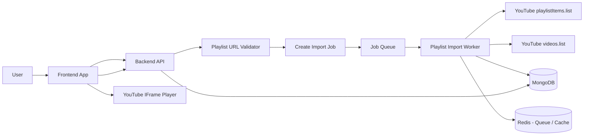
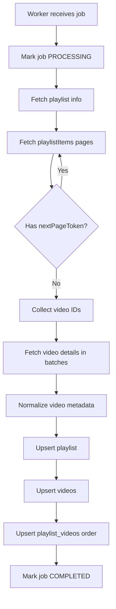

# YouFlix Backend High-Level Design

## Project Goal

Build a backend system where a user can paste a public YouTube playlist link, and the system will:

1. Extract the YouTube playlist ID from the link.
2. Fetch all videos in the playlist using the YouTube Data API.
3. Store playlist and video metadata in MongoDB.
4. Preserve the correct video order from the playlist.
5. Expose APIs so the frontend can display the playlist as a Netflix-style show page.
6. Play videos on the frontend using the official YouTube IFrame Player, not by downloading or rehosting videos.

The MVP should focus on public YouTube playlists only.

---

## Core Product Concept

The app lets users convert any public YouTube playlist into a clean, organized “show” page.

Example user flow:

```text
User pastes YouTube playlist URL
        ↓
Backend validates and extracts playlist ID
        ↓
Backend creates playlist import job
        ↓
Worker fetches playlist videos from YouTube
        ↓
Worker stores playlist + videos in MongoDB
        ↓
Frontend shows organized Netflix-style playlist page
        ↓
User watches videos using embedded YouTube player
```

---

## High-Level Architecture



---

## Recommended Tech Stack

### Backend

- Node.js
- Express.js or NestJS
- TypeScript
- MongoDB Atlas
- Mongoose
- BullMQ for background jobs
- Redis for job queue and optional caching
- YouTube Data API v3

### Frontend

- Next.js
- React
- Tailwind CSS
- YouTube IFrame Player API

### Infrastructure

- MongoDB Atlas for database
- Redis Cloud / Upstash / local Redis for queue
- Render, Railway, Fly.io, AWS, or GCP for deployment
- Environment variables for API keys and secrets

---

## Main Backend Components

## 1. API Server

The API server handles user requests from the frontend.

Responsibilities:

- Authenticate users, if auth is enabled.
- Accept playlist import requests.
- Validate YouTube playlist URLs.
- Create import jobs.
- Return playlist details.
- Return ordered videos for a playlist.
- Trigger manual playlist sync.
- Return import job progress.

Suggested routes:

```text
POST   /api/playlists/import
GET    /api/import-jobs/:jobId
GET    /api/playlists/:playlistId
GET    /api/playlists/:playlistId/videos
POST   /api/playlists/:playlistId/sync
DELETE /api/playlists/:playlistId
```

---

## 2. Playlist URL Validator

The validator extracts the playlist ID from a YouTube URL.

Supported URL examples:

```text
https://www.youtube.com/playlist?list=PLAYLIST_ID
https://www.youtube.com/watch?v=VIDEO_ID&list=PLAYLIST_ID
https://youtube.com/playlist?list=PLAYLIST_ID
https://m.youtube.com/playlist?list=PLAYLIST_ID
```

Example TypeScript helper:

```ts
export function extractPlaylistId(inputUrl: string): string {
  try {
    const parsedUrl = new URL(inputUrl);
    const playlistId = parsedUrl.searchParams.get("list");

    if (!playlistId) {
      throw new Error("Missing playlist ID");
    }

    return playlistId;
  } catch {
    throw new Error("Invalid YouTube playlist URL");
  }
}
```

---

## 3. Job Queue

Playlist imports should run in the background because large playlists can take time.

Do not fetch all videos inside the HTTP request.

Recommended approach:

```text
Frontend calls POST /api/playlists/import
        ↓
API validates URL
        ↓
API creates import_jobs document
        ↓
API pushes job into BullMQ queue
        ↓
API immediately returns jobId
        ↓
Frontend polls GET /api/import-jobs/:jobId
```

Suggested queue name:

```text
playlist-import-queue
```

---

## 4. Playlist Import Worker

The worker processes playlist import jobs.

Responsibilities:

1. Read job from queue.
2. Mark job as `PROCESSING`.
3. Extract playlist ID.
4. Fetch playlist metadata from YouTube.
5. Fetch playlist items using pagination.
6. Collect all YouTube video IDs.
7. Fetch video details in batches.
8. Upsert playlist document.
9. Upsert video documents.
10. Upsert playlist-video mapping documents.
11. Mark job as `COMPLETED`, `FAILED`, or `PARTIAL_FAILED`.

Worker flow:



---

## YouTube API Usage

### Fetch Playlist Items

Use YouTube Data API endpoint:

```text
playlistItems.list
```

Purpose:

- Fetch videos inside a playlist.
- Preserve the playlist order using the `position` field.
- Use pagination with `nextPageToken`.

Request fields:

```text
part=snippet,contentDetails
playlistId=PLAYLIST_ID
maxResults=50
pageToken=OPTIONAL_NEXT_PAGE_TOKEN
```

Important fields from response:

```text
items[].snippet.title
items[].snippet.description
items[].snippet.position
items[].snippet.resourceId.videoId
items[].snippet.thumbnails
items[].snippet.channelId
items[].snippet.channelTitle
items[].contentDetails.videoId
items[].contentDetails.videoPublishedAt
nextPageToken
```

---

### Fetch Video Details

Use YouTube Data API endpoint:

```text
videos.list
```

Purpose:

- Get richer video metadata.
- Fetch duration.
- Fetch statistics.
- Check public/private/deleted availability.

Request fields:

```text
part=snippet,contentDetails,statistics,status
id=COMMA_SEPARATED_VIDEO_IDS
```

Important fields from response:

```text
items[].id
items[].snippet.title
items[].snippet.description
items[].snippet.channelId
items[].snippet.channelTitle
items[].snippet.publishedAt
items[].snippet.thumbnails
items[].contentDetails.duration
items[].statistics.viewCount
items[].statistics.likeCount
items[].status.privacyStatus
items[].status.embeddable
```

---

## MongoDB Data Model

## Collection: users

```js
{
  _id: ObjectId,
  email: String,
  name: String,
  avatarUrl: String,
  createdAt: Date,
  updatedAt: Date
}
```

Indexes:

```js
{ email: 1 }, unique: true
```

---

## Collection: playlists

Stores one imported YouTube playlist.

```js
{
  _id: ObjectId,

  youtubePlaylistId: String,
  source: "youtube",

  title: String,
  description: String,
  thumbnailUrl: String,

  channelId: String,
  channelTitle: String,

  importedByUserId: ObjectId,

  visibility: "public",
  videoCount: Number,

  syncStatus: "READY" | "SYNCING" | "FAILED",
  lastSyncedAt: Date,
  lastImportJobId: ObjectId,

  createdAt: Date,
  updatedAt: Date
}
```

Indexes:

```js
{ youtubePlaylistId: 1 }, unique: true
{ importedByUserId: 1 }
{ channelId: 1 }
{ title: "text", description: "text" }
```

---

## Collection: videos

Stores unique YouTube video metadata.

```js
{
  _id: ObjectId,

  youtubeVideoId: String,
  source: "youtube",

  title: String,
  description: String,

  channelId: String,
  channelTitle: String,

  thumbnailUrl: String,

  durationIso: String,
  durationSeconds: Number,

  publishedAt: Date,

  viewCount: Number,
  likeCount: Number,

  embeddable: Boolean,
  privacyStatus: "public" | "private" | "unlisted",
  availabilityStatus: "available" | "private" | "deleted" | "unavailable",

  createdAt: Date,
  updatedAt: Date
}
```

Indexes:

```js
{ youtubeVideoId: 1 }, unique: true
{ channelId: 1 }
{ title: "text", description: "text" }
```

---

## Collection: playlist_videos

Stores the relationship between a playlist and its videos.

This collection is important because:

- One video can appear in many playlists.
- The same video can have different positions in different playlists.
- Playlist order must be preserved.

```js
{
  _id: ObjectId,

  playlistId: ObjectId,
  videoId: ObjectId,

  youtubePlaylistId: String,
  youtubeVideoId: String,

  position: Number,
  episodeNumber: Number,

  isActive: Boolean,
  removedFromPlaylistAt: Date | null,

  addedToPlaylistAt: Date,

  createdAt: Date,
  updatedAt: Date
}
```

Indexes:

```js
{ playlistId: 1, position: 1 }
{ playlistId: 1, youtubeVideoId: 1 }, unique: true
{ youtubeVideoId: 1 }
```

---

## Collection: import_jobs

Tracks playlist import progress.

```js
{
  _id: ObjectId,

  userId: ObjectId,

  playlistUrl: String,
  youtubePlaylistId: String,
  playlistId: ObjectId | null,

  status: "QUEUED" | "PROCESSING" | "COMPLETED" | "FAILED" | "PARTIAL_FAILED",

  totalVideosFound: Number,
  totalVideosImported: Number,
  totalVideosFailed: Number,

  errorMessage: String | null,
  errorCode: String | null,

  retryCount: Number,

  startedAt: Date | null,
  completedAt: Date | null,

  createdAt: Date,
  updatedAt: Date
}
```

Indexes:

```js
{ userId: 1, createdAt: -1 }
{ status: 1 }
{ youtubePlaylistId: 1 }
```

---

## API Design

## POST /api/playlists/import

Starts a playlist import.

Request:

```json
{
  "url": "https://www.youtube.com/playlist?list=PLxxxx"
}
```

Success response:

```json
{
  "jobId": "65f123...",
  "status": "QUEUED",
  "message": "Playlist import started"
}
```

If playlist already exists and was recently synced:

```json
{
  "playlistId": "65f999...",
  "status": "ALREADY_IMPORTED",
  "message": "Playlist already exists"
}
```

Backend logic:

```text
1. Validate request body.
2. Extract playlistId from URL.
3. Check MongoDB for existing playlist.
4. If playlist exists and lastSyncedAt is recent, return existing playlist.
5. Create import_jobs document.
6. Push job to BullMQ.
7. Return jobId.
```

---

## GET /api/import-jobs/:jobId

Returns job status.

Response:

```json
{
  "jobId": "65f123...",
  "status": "PROCESSING",
  "youtubePlaylistId": "PLxxxx",
  "totalVideosFound": 120,
  "totalVideosImported": 80,
  "totalVideosFailed": 0,
  "errorMessage": null
}
```

---

## GET /api/playlists/:playlistId

Returns playlist details.

Response:

```json
{
  "id": "65f999...",
  "youtubePlaylistId": "PLxxxx",
  "title": "Full JavaScript Course",
  "description": "A complete JavaScript playlist",
  "thumbnailUrl": "https://...",
  "channelTitle": "Example Creator",
  "videoCount": 42,
  "lastSyncedAt": "2026-07-03T12:00:00.000Z"
}
```

---

## GET /api/playlists/:playlistId/videos

Returns ordered playlist videos.

Response:

```json
[
  {
    "id": "65faaa...",
    "youtubeVideoId": "abc123",
    "position": 0,
    "episodeNumber": 1,
    "title": "Episode 1",
    "thumbnailUrl": "https://...",
    "durationSeconds": 1240,
    "channelTitle": "Example Creator",
    "embeddable": true
  },
  {
    "id": "65fbbb...",
    "youtubeVideoId": "def456",
    "position": 1,
    "episodeNumber": 2,
    "title": "Episode 2",
    "thumbnailUrl": "https://...",
    "durationSeconds": 980,
    "channelTitle": "Example Creator",
    "embeddable": true
  }
]
```

Sort by:

```js
{ position: 1 }
```

---

## POST /api/playlists/:playlistId/sync

Manually re-syncs a playlist.

Request:

```json
{}
```

Response:

```json
{
  "jobId": "65f456...",
  "status": "QUEUED",
  "message": "Playlist sync started"
}
```

---

## Import Worker Pseudocode

```ts
async function processPlaylistImportJob(job: PlaylistImportJob) {
  const { jobId, playlistUrl, userId } = job.data;

  await ImportJob.updateOne(
    { _id: jobId },
    {
      status: "PROCESSING",
      startedAt: new Date(),
    }
  );

  try {
    const youtubePlaylistId = extractPlaylistId(playlistUrl);

    const playlistMetadata = await youtubeClient.getPlaylistMetadata(youtubePlaylistId);

    const playlistItems = await youtubeClient.getAllPlaylistItems(youtubePlaylistId);

    const youtubeVideoIds = playlistItems
      .map((item) => item.youtubeVideoId)
      .filter(Boolean);

    const videoDetails = await youtubeClient.getVideosByIds(youtubeVideoIds);

    const playlist = await Playlist.findOneAndUpdate(
      { youtubePlaylistId },
      {
        youtubePlaylistId,
        source: "youtube",
        title: playlistMetadata.title,
        description: playlistMetadata.description,
        thumbnailUrl: playlistMetadata.thumbnailUrl,
        channelId: playlistMetadata.channelId,
        channelTitle: playlistMetadata.channelTitle,
        importedByUserId: userId,
        videoCount: playlistItems.length,
        syncStatus: "READY",
        lastSyncedAt: new Date(),
      },
      { upsert: true, new: true }
    );

    for (const video of videoDetails) {
      await Video.findOneAndUpdate(
        { youtubeVideoId: video.youtubeVideoId },
        {
          ...video,
          source: "youtube",
          updatedAt: new Date(),
        },
        { upsert: true, new: true }
      );
    }

    for (const item of playlistItems) {
      const video = await Video.findOne({ youtubeVideoId: item.youtubeVideoId });

      if (!video) continue;

      await PlaylistVideo.findOneAndUpdate(
        {
          playlistId: playlist._id,
          youtubeVideoId: item.youtubeVideoId,
        },
        {
          playlistId: playlist._id,
          videoId: video._id,
          youtubePlaylistId,
          youtubeVideoId: item.youtubeVideoId,
          position: item.position,
          episodeNumber: item.position + 1,
          isActive: true,
          addedToPlaylistAt: item.videoPublishedAt,
          updatedAt: new Date(),
        },
        { upsert: true, new: true }
      );
    }

    await ImportJob.updateOne(
      { _id: jobId },
      {
        status: "COMPLETED",
        playlistId: playlist._id,
        totalVideosFound: playlistItems.length,
        totalVideosImported: videoDetails.length,
        completedAt: new Date(),
      }
    );
  } catch (error) {
    await ImportJob.updateOne(
      { _id: jobId },
      {
        status: "FAILED",
        errorMessage: error.message,
        completedAt: new Date(),
      }
    );

    throw error;
  }
}
```

---

## YouTube Client Pseudocode

```ts
class YouTubeClient {
  async getAllPlaylistItems(playlistId: string) {
    const allItems = [];
    let nextPageToken: string | undefined = undefined;

    do {
      const response = await youtube.playlistItems.list({
        part: ["snippet", "contentDetails"],
        playlistId,
        maxResults: 50,
        pageToken: nextPageToken,
      });

      const items = response.data.items || [];

      for (const item of items) {
        const videoId = item.contentDetails?.videoId || item.snippet?.resourceId?.videoId;

        if (!videoId) continue;

        allItems.push({
          youtubeVideoId: videoId,
          title: item.snippet?.title,
          description: item.snippet?.description,
          position: item.snippet?.position,
          thumbnailUrl: getBestThumbnail(item.snippet?.thumbnails),
          channelId: item.snippet?.channelId,
          channelTitle: item.snippet?.channelTitle,
          videoPublishedAt: item.contentDetails?.videoPublishedAt,
        });
      }

      nextPageToken = response.data.nextPageToken || undefined;
    } while (nextPageToken);

    return allItems;
  }

  async getVideosByIds(videoIds: string[]) {
    const batches = chunk(videoIds, 50);
    const videos = [];

    for (const batch of batches) {
      const response = await youtube.videos.list({
        part: ["snippet", "contentDetails", "statistics", "status"],
        id: batch,
      });

      for (const item of response.data.items || []) {
        videos.push({
          youtubeVideoId: item.id,
          title: item.snippet?.title,
          description: item.snippet?.description,
          channelId: item.snippet?.channelId,
          channelTitle: item.snippet?.channelTitle,
          thumbnailUrl: getBestThumbnail(item.snippet?.thumbnails),
          durationIso: item.contentDetails?.duration,
          durationSeconds: parseYouTubeDuration(item.contentDetails?.duration),
          publishedAt: item.snippet?.publishedAt,
          viewCount: Number(item.statistics?.viewCount || 0),
          likeCount: Number(item.statistics?.likeCount || 0),
          privacyStatus: item.status?.privacyStatus,
          embeddable: item.status?.embeddable,
          availabilityStatus: item.status?.privacyStatus === "public" ? "available" : "unavailable",
        });
      }
    }

    return videos;
  }
}
```

---

## Duration Parsing

YouTube returns video durations in ISO 8601 format.

Example:

```text
PT1H12M30S
PT8M15S
PT45S
```

Create a helper to convert this into seconds:

```ts
export function parseYouTubeDuration(duration: string): number {
  const match = duration.match(/PT(?:(\d+)H)?(?:(\d+)M)?(?:(\d+)S)?/);

  if (!match) return 0;

  const hours = Number(match[1] || 0);
  const minutes = Number(match[2] || 0);
  const seconds = Number(match[3] || 0);

  return hours * 3600 + minutes * 60 + seconds;
}
```

---

## Thumbnail Helper

Use the highest quality thumbnail available.

```ts
function getBestThumbnail(thumbnails: any): string | null {
  if (!thumbnails) return null;

  return (
    thumbnails.maxres?.url ||
    thumbnails.standard?.url ||
    thumbnails.high?.url ||
    thumbnails.medium?.url ||
    thumbnails.default?.url ||
    null
  );
}
```

---

## Sync Strategy

YouTube playlists can change after import.

Support two sync types:

### Manual Sync

User clicks “Refresh Playlist”.

```text
POST /api/playlists/:playlistId/sync
```

### Automatic Sync

Recommended rules:

```text
Recently viewed playlists: sync every 24 hours
Older playlists: sync every 7 days
Failed syncs: retry with exponential backoff
```

During sync:

```text
1. Fetch latest YouTube playlist items.
2. Compare fetched video IDs with stored playlist_videos.
3. Add new videos.
4. Update changed positions.
5. Mark removed videos as isActive=false.
6. Update playlist lastSyncedAt.
```

Do not hard-delete removed videos immediately, because watch history may depend on them later.

---

## Error Handling

Handle these cases:

```text
Invalid playlist URL
Missing playlist ID
Playlist not found
Private playlist
Deleted video
Private video
Video embedding disabled
YouTube quota exceeded
YouTube API key invalid
Network timeout
Duplicate playlist import
Worker crash
MongoDB write failure
Partial import failure
```

Recommended job status handling:

```text
QUEUED: Job created but not started
PROCESSING: Worker is importing videos
COMPLETED: Playlist imported successfully
FAILED: Import failed completely
PARTIAL_FAILED: Some videos failed but playlist was mostly imported
```

---

## Quota-Saving Rules

Use these from day one:

```text
Do not re-import the same playlist too often.
Check lastSyncedAt before calling YouTube again.
Use playlistId imports instead of YouTube search.
Use pagination properly.
Batch video detail requests.
Store results in MongoDB.
Use retries with backoff.
Avoid polling YouTube repeatedly from the frontend.
```

---

## Security and Compliance Notes

Important rules:

```text
Do not download YouTube videos.
Do not rehost YouTube videos.
Do not hide YouTube branding.
Do not bypass YouTube ads or player behavior.
Use the official YouTube IFrame Player for playback.
Use YouTube Data API for metadata.
For MVP, support public playlists only.
Add OAuth later for private playlists.
```

Store only metadata and references:

```text
youtubePlaylistId
youtubeVideoId
title
description
thumbnail URL
duration
channel data
position/order
```

---

## MVP Scope

Build only this first:

```text
User pastes public YouTube playlist URL
Backend imports playlist
Backend stores playlist metadata
Backend stores video metadata
Backend preserves video order
Frontend displays playlist as a show
Frontend plays video using YouTube embed
```

Do not build these in MVP:

```text
No AI recommendations yet
No private playlist support yet
No season detection yet
No social features yet
No comments yet
No creator dashboard yet
No payment system yet
```

---

## Suggested Folder Structure

```text
backend/
  src/
    config/
      env.ts
      database.ts
      queue.ts
    modules/
      playlists/
        playlist.model.ts
        playlist.controller.ts
        playlist.service.ts
        playlist.routes.ts
      videos/
        video.model.ts
        video.service.ts
      playlist-videos/
        playlistVideo.model.ts
      import-jobs/
        importJob.model.ts
        importJob.service.ts
      youtube/
        youtube.client.ts
        youtube.helpers.ts
      workers/
        playlistImport.worker.ts
    utils/
      extractPlaylistId.ts
      parseYouTubeDuration.ts
      chunk.ts
    app.ts
    server.ts
```

---

## Environment Variables

```bash
PORT=4000
NODE_ENV=development

MONGODB_URI=mongodb+srv://...
REDIS_URL=redis://localhost:6379

YOUTUBE_API_KEY=your_youtube_data_api_key

JWT_SECRET=your_jwt_secret
FRONTEND_URL=http://localhost:3000
```

---

## Implementation Order for Cursor

Give Cursor these tasks in order:

```text
1. Set up Node.js + TypeScript backend with Express.
2. Connect MongoDB using Mongoose.
3. Create Playlist, Video, PlaylistVideo, and ImportJob models.
4. Create helper to extract YouTube playlist ID from URL.
5. Create YouTube client using YouTube Data API.
6. Implement playlistItems pagination.
7. Implement videos.list batch metadata fetching.
8. Set up BullMQ and Redis.
9. Create POST /api/playlists/import endpoint.
10. Create playlist import worker.
11. Create GET /api/import-jobs/:jobId endpoint.
12. Create GET /api/playlists/:playlistId endpoint.
13. Create GET /api/playlists/:playlistId/videos endpoint.
14. Add error handling and validation.
15. Add manual playlist sync endpoint.
```

---

## Cursor Prompt

Use this prompt in Cursor:

```text
You are helping me build the backend for YouFlix, a Netflix-style app for organizing YouTube playlists.

Build a Node.js + TypeScript + Express backend with MongoDB, Mongoose, Redis, and BullMQ.

The main feature is: users paste a public YouTube playlist URL, the backend extracts the playlist ID, creates an import job, fetches all videos using the YouTube Data API, stores playlist metadata and video metadata in MongoDB, preserves video order, and exposes API endpoints for the frontend.

Please follow this architecture:

Collections:
- users
- playlists
- videos
- playlist_videos
- import_jobs

Endpoints:
- POST /api/playlists/import
- GET /api/import-jobs/:jobId
- GET /api/playlists/:playlistId
- GET /api/playlists/:playlistId/videos
- POST /api/playlists/:playlistId/sync

Use BullMQ for background playlist imports.
Use Redis for the queue.
Use YouTube Data API playlistItems.list to fetch playlist videos.
Use YouTube Data API videos.list to enrich video metadata.
Do not download or store actual video files.
Store only YouTube metadata and IDs.

Start by creating the project structure, Mongoose models, environment config, and helper functions. Then implement the import endpoint and worker.
```

---

## Final MVP Summary

The first version of YouFlix backend should do one thing really well:

```text
Paste a public YouTube playlist link → import all videos → store organized metadata → display as a Netflix-style show page.
```

Once this is stable, add:

```text
User watchlists
Watch history
Continue watching
Recommendations
AI categorization
Creator pages
Season detection
Private playlist imports with OAuth
```
